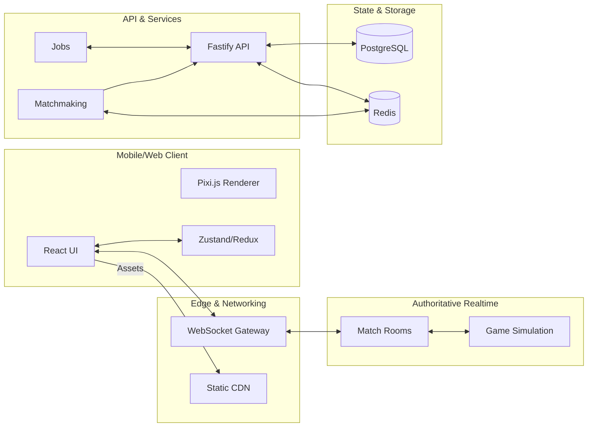

## Kingland: Royale

Real-time PvP card-based strategy, built mobile-first. Outplay opponents in 3–5 minute duels by deploying units, casting spells, and capturing lanes. Inspired by the fast, tactical cadence of Clash Royale, designed to be fair, competitive, and deeply replayable.

—

### Status
- **Repo**: [emiliancristea/kingland-royale](https://github.com/emiliancristea/kingland-royale)
- **Stage**: Concept + Technical Design (code scaffolding in progress)
- **License**: MIT

### Highlights
- **Mobile-first, responsive UI**: thumb-zone controls, adaptive layout, 60 FPS target.
- **Real-time PvP**: deterministic server with authoritative state, low-latency netcode.
- **Card-driven strategy**: deck building, elixir-like economy, counters/anti-counters.
- **Short matches**: 3–5 minutes; overtime pressure mechanics and sudden-death win conditions.
- **Fair progression**: skill-forward MMR, seasonal ranks, cosmetics-first monetization.

### Gameplay Overview
1. Build a deck (8 cards: units, buildings, spells) with defined roles and synergies.
2. Queue into ranked or unranked; matchmaking by hidden MMR and region.
3. Real-time duel on a 2–3 lane arena; push, defend, rotate, and counter-push.
4. Manage economy (elixir/mana) to cycle and spike at the right timings.
5. Victory by core destruction, tower advantage, or overtime tiebreak rules.

### Core Systems (Planned)
- **Matchmaking & MMR**: Glicko2/Elo hybrid, placement games, decay for inactivity.
- **Authoritative Server**: fixed-timestep simulation, input commands, state diffs.
- **Netcode**: client-side prediction, input delay, reconciliation, delta compression.
- **Deck & Cards**: rarity tiers, upgrade tracks, balance patches, rotation events.
- **Live Ops**: events, quests, free/paid track battle pass, shop with cosmetics.

### Tech Stack (Proposed)
- **Client**: TypeScript, React (or Solid), Vite, Zustand/Redux, Tailwind or UnoCSS, Pixi.js/Canvas/WebGL for battlefield rendering.
- **Realtime**: Colyseus or custom WebSocket server on Node.js/TypeScript.
- **Backend**: Node.js (Fastify), PostgreSQL (Prisma), Redis (matchmaking, cache), BullMQ (jobs).
- **Infra**: Docker, GitHub Actions, Fly.io/Render/Cloud Run, Cloudflare CDN, Sentry.

### High-level Architecture (Mermaid)


### Roadmap
- **MVP**
  - Core battlefield, pathing, targeting, damage, and tower logic.
  - Deck builder (local), 12–16 starter cards, 1–2 arenas, single ranked queue.
  - Authoritative realtime rooms with reconciling clients; simple MMR.
  - Basic cosmetics, daily rewards, and minimal shop (non-monetized in dev).
  - Telemetry and crash reporting.
- **Stretch**
  - Spectator mode, replays, tournaments, clans, friendly battles.
  - Seasonal battle pass, live events, rotating modifiers, card bans/rotations.
  - Social identity, cross-play, server regions with Anycast/Edge WS.
  - Anti-cheat hardening, server replay validation, bot detection.

### Local Development (Windows PowerShell)
Prerequisites:
- Node.js LTS (>= 20)
- pnpm (recommended) or npm

Setup:
```powershell
# Clone
git clone https://github.com/emiliancristea/kingland-royale.git
cd kingland-royale

# Install (once code scaffolding is added)
# pnpm install

# Start dev servers (client and server planned)
# In separate terminals
# pnpm --filter @kingland/client dev
# pnpm --filter @kingland/server dev
```

### Contributing
We welcome issues and PRs. Please:
- Open an issue to discuss substantial changes first.
- Provide clear steps to test; keep edits scoped and lint clean.
- Follow semantic commits: `type(scope): summary`.

### Security
- Report vulnerabilities privately via GitHub Security Advisories.
- Do not open public issues for sensitive findings.

### License
MIT © Contributors

### Credits & Inspiration
Inspired by the clarity and pacing of real-time lane battlers. Built for competitive fairness and expressive counterplay.


